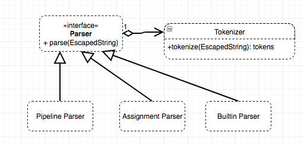

# Архитектура

Данные обрабатываются по следующей схеме:

 

Пользователь вводит в CLI команду, которая должна быть исполнена. Строка преобразовывается в Escaped String, которая разграничивает обычные символы от экранированных. 

Следующим этапом является парсинг этой строки: приоритетным является парсер Pipeline, который разбивает строку по пайпам('|') и далее каждая отдельная часть, заключенная между пайпами, парсится отдельно через Assignment и Builtin Parser.
Если пайпов нет, то считается, что мы не смогли распарсить строку и передаем ее следуюдим парсерам -- Assignment и Builtin, которые пытаются распарсить эту часть в том же порядке, как бы если это была частью, заключенной между пайпами.
Приоритет у Assignment Parser, который пытается разобрать в строке присваивание, собственно, если он его находит, тогда записывает в Environment переменную, которая хранится для следующей ее замены. 
Если и Assignment не смог распарсится, то последним парсером является парсер встроенной команды, который отделяет первый токен от остальных и считает этот токен названием команды, а остальные -- ее аргументами.

 

Внутри себя парсеры для удобства работы разбивают EscapedString на токены с помощью класса Tokenizer. Это позволяет легко абстрагироваться и отделить имя команды от аргументов. Также, есть ReplaceToken, которые будут заменятся в дальнейшем при исполнении команды на значения, которые пользователь сохранил до этого.

Каждый из парсеров возвращает подходящий Operator, который умеет исполнять то, что ввел пользователь. В зависимости от ввода исполняется подходящий Оператор: Pipeline, Assignment или Builtin. 
Передав оператору Environment он исполнит команду: вызовет у Environment команду с нужным именем и аргументами, а также заменит с помощью того же объекта переменные указанные со знаком '$'. 
Environment уже внутри себя либо находит подходящую утилиту, которая непосредственно выполняет команду пользователя. Имя утилиты должно быть заранее зарегистрировано, чтобы пользователь мог вызывать утилиту под известным именем.

После работы оператора возвращается объект типа ExecutionResult, содержащий вывод команды, а также флаг, который равен true, если нужно выйти из CLI, false в противном случае.